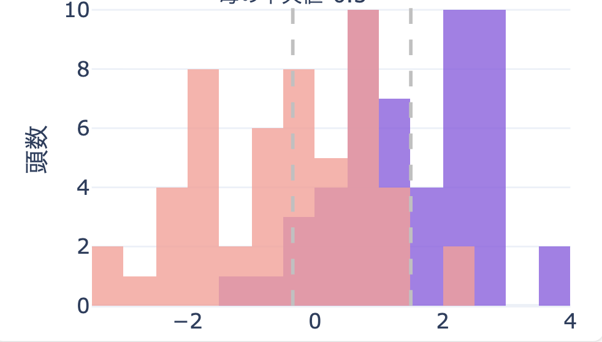

# 改良インパクトシミュレーション

## 1. 機能概要

### 1.1. 機能名
- 改良による収益効果シミュレーション

### 1.2. 目的と背景
- **目的**: メイティングファイルをインプットとして、乳量による改良インパクトを計算できるようにする
- **背景**: CDCBによるゲノム検査と日本での実際の生産性を比較するデータが無く、強力なエビデンスがあるシミュレーション方法がなかった。

### 1.3. ターゲットユーザー
- [この機能の主な利用者層を具体的に記述]

### 1.4. 解決する課題
- 改良
- [ターゲットユーザーが現在抱えているどのような問題を解決するのかを記述]

## 2. 機能要件

### 2.1. Must-Have (必須要件)

必要要件
- 現状割り当てられているメイティング項目に対して、その計画が実行された場合の4年後の乳量シミュレーションができるようになること

必要機能

- 管理的な牛群構成のシミュレーション機能
    - 以下の設定値を元に、現在の牛群からシミュレーションを行い、数年後の経産牛群のゲノム値の構成を見える化する
    - ユーザー設定項目（管理的な牛群構成のシミュレーションに利用）
        - 各三次の年間更新率（1産, 2産, 3産以上）
    - 平均分娩間隔

- 

- 繁殖インデックス × 受胎率 
    - 同上

以下、経産牛群におけるゲノムの改良度合いを可視化。
可視化方法
- 1. 
- 2. 体型の場合には、特定の範囲内に収まっていることがわかるような可視化方法を採用する

可視化方法の想定

| 項目           | 要件  |
| :----------- | :-- |
| 乳量           | 1   |
| 乳脂肪量         | 1   |
| 乳タンパク質量      | 1   |
| 生産寿命         | 1   |
| 繁殖（繁殖インデックス） | 1   |
| 娘牛妊娠率（DPR）   | 1   |
| 分娩能力（CA$）    | 1   |
| 未経産牛受胎率（HCR） | 1   |
| 経産牛受胎率（CCR）  | 1   |
| 飼料効率（RFI）    | 1   |
| 体細胞数         | 1   |
| 乳房炎抵抗        | 1   |
| 体高（BWC）      | 1   |
| 乳器（UDC）      | 2   |
| 前乳頭配置        | 2   |
| 後乳頭配置        | 2   |
| 乳頭高          | 2   |
| 肢蹄（FLC）      | 1   |
| 生存能力（LIV）    | 1   |
| 健康（HTH）      | 1   |
|              |     |

---

## 4. 非機能要件

| 項目 | 要件 |
| :--- | :--- |

---

## 5. リリース計画

### 5.1. マイルストーン
| フェーズ | 主なタスク | 完了予定日 |
| :--- | :--- | :--- |
| 設計 | [要件定義、技術設計] | YYYY/MM/DD |
| 開発 | [実装、単体テスト] | YYYY/MM/DD |
| テスト | [結合テスト、UAT] | YYYY/MM/DD |
| リリース | [本番環境へのデプロイ] | YYYY/MM/DD |

---

## 6. 保留・検討事項

### 飼料摂取量のモデル化について
- **現状の課題**: 飼料の摂取量は、平均乳量、頭数規模、飼料の削減量の変動要因に依存する
- **シミュレーションへの影響**:
    - 仮に固定値として入力した場合、摂取量は常に一定となり、シミュレーション結果に影響を与えない要素となる
    - 一方で、摂取量を正確にモデル化しようとすると、分析用のデータ収集が必要
- **結論**
    - 定数としていれる程度では、あまり意味がない。

### メイティングごとのシナリオ比較
- **想定機能**: 
	- 複数のメイティングファイルごとに収益効果を比較する機能
- **検討事項**: 
	- メイティングをすることを意思決定したユーザーは、複数ファイルで改良比較することはあまりないため、用途がが限定的だと思われる

### 個体販売金額を加味したシミュレーションについて
- **想定機能**:
	- 現状と未来の「和牛ET産子、F1」の平均販売金額を入力し、繁殖のコストと収益改善効果を可視化
- **検討事項**: 
	- 繁殖の戦略的変更まで加味するのは、シミュレーションとして中途半端な考慮で、逆にノイズになりうる。
- **調査事項**: 
	- 牧場ごとの過去の個体販売金額の入力状況など
- **留意事項**: 
	- シミュレーションに基づく生産KPIのガイドライン機能は別であった方が良い
	- 牛群の遺伝的ポテンシャルに対して、どこまで、度のタイミングで生産性を引き出せるのか？生産KPIの目標ガイドラインがあっても良いと思われる。
		- 例えば、{乳量40kg/day, 受胎率42%, 平均分娩間隔xx日、産次構成x:y:z}、などの生産KPIの組み合わせ。
	- 一方で複数の生産KPIがある場合、それらが**同時に成り立つか**はシミュレーションとベンチマークの組み合わせにより確認する必要がある。
	- 中途半端に作ると逆に使い勝手が悪くなる可能性が高い。実データ分析をして、使い勝手の検証が必要か。
