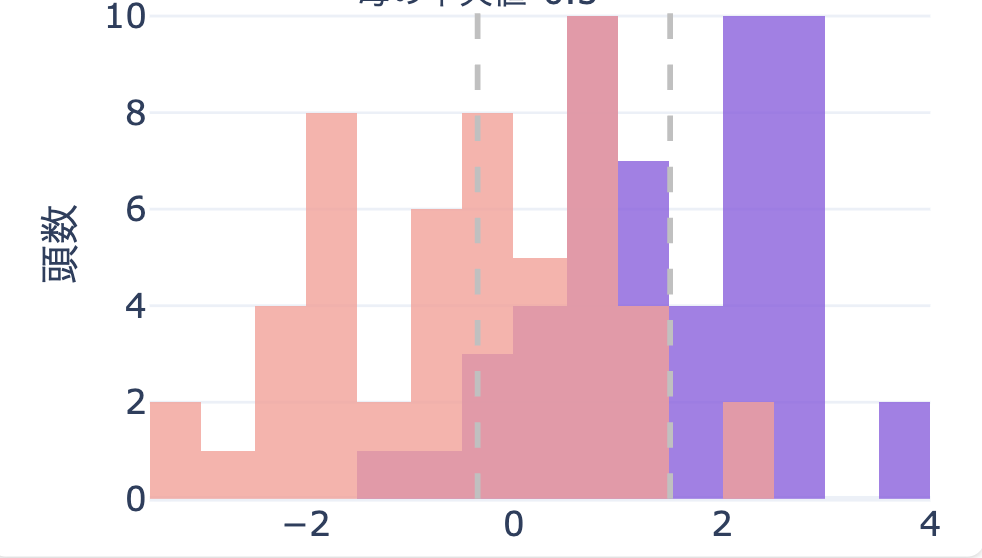

# 改良インパクトシミュレーション

## 1. 機能概要

### 1.1. 機能名
- 改良による収益効果シミュレーション

### 1.2. 目的と背景
- **目的**: メイティングファイルをインプットとして、乳量による改良インパクトを計算できるようにする
- **背景**: CDCBによるゲノム検査と日本での実際の生産性を比較するデータが無く、強力なエビデンスがあるシミュレーション方法がなかった。

### 1.3. ターゲットユーザー
- [この機能の主な利用者層を具体的に記述]

### 1.4. 解決する課題
- 改良
- [ターゲットユーザーが現在抱えているどのような問題を解決するのかを記述]

## 2. 機能要件

### 2.1. Must-Have (必須要件)

必要要件
- 現状割り当てられているメイティング項目に対して、その計画が実行された場合の4年後の乳量シミュレーションができるようになること

必要機能

- 管理的な牛群構成のシミュレーション機能
    - 以下の設定値を元に、現在の牛群からシミュレーションを行い、数年後の経産牛群のゲノム値の構成を見える化する
    - ユーザー設定項目（管理的な牛群構成のシミュレーションに利用）
        - 各三次の年間更新率（1産, 2産, 3産以上）
    - 平均分娩間隔

- 

- 繁殖インデックス × 受胎率 
    - 同上

以下、経産牛群におけるゲノムの改良度合いを可視化。
可視化方法
- 1. 
- 2. 体型の場合には、特定の範囲内に収まっていることがわかるような可視化方法を採用する

可視化方法の想定

| 項目           | 要件  |
| :----------- | :-- |
| 乳量           | 1   |
| 乳脂肪量         | 1   |
| 乳タンパク質量      | 1   |
| 生産寿命         | 1   |
| 繁殖（繁殖インデックス） | 1   |
| 娘牛妊娠率（DPR）   | 1   |
| 分娩能力（CA$）    | 1   |
| 未経産牛受胎率（HCR） | 1   |
| 経産牛受胎率（CCR）  | 1   |
| 飼料効率（RFI）    | 1   |
| 体細胞数         | 1   |
| 乳房炎抵抗        | 1   |
| 体高（BWC）      | 1   |
| 乳器（UDC）      | 2   |# 改良インパクトシミュレーション機能提案 v2

## 1. 機能概要

### 1.1. 機能名

改良による収益効果シミュレーション

### 1.2. 目的と背景

- **目的**: アップロードされたメイティングファイルに基づき、将来の乳量増加による収益インパクトをシミュレーションし、継続的に改良への投資を促す
- **背景**: これまで、CDCB（Council on Dairy Cattle Breeding）によるゲノム評価値と、日本国内における実際の生産性との関連を示す客観的なデータが不足していた。そのため、ゲノム情報に基づいた改良計画がもたらす経済的効果を、具体的な数値で示すことが困難だった。

### 1.3. ターゲットユーザー

- **酪農経営者**: 遺伝的改良への投資対効果を評価し、繁殖方針を決定したいと考えている経営者。
- **ファームノートソリューション営業**: 客観的なデータに基づき、クライアントである牧場に対して改良効果のエビデンスを提示する

### 1.4. 解決する課題

- **課題**: ゲノム改良への投資が、将来どれだけの経済的リターン（乳代収入の向上）をもたらすかが不明確で、投資判断が難しい。
- **解決策**: 本機能により、具体的なメイティングが将来の乳生産に与える影響を数値で可視化する。これにより、感覚や経験則に頼っていた改良計画の評価を、データドリブンな意思決定へと転換させる。

---

## 2. 機能要件

### 2.1. 必須要件（Must-Have）

- 現在のメイティング計画を実行した場合の、3〜4年後の牛群における乳量変化をシミュレーションできること。

### 2.2. 主要機能

#### 2.2.1. 牛群構成シミュレーション

現在の牛群データとユーザー設定値を基に、将来（数年後）の経産牛群のゲノム値構成をシミュレーションし、可視化する。

- **ユーザー設定項目**:
    - 産次ごとの年間更新率（1産、2産、3産以上）
    - 平均分娩間隔

#### 2.2.2. 改良効果の可視化

シミュレーション結果をグラフや表を用いて分かりやすく表示する。

1.  **収益インパクトの可視化**:
    - 乳代収入とNet Merit (NM$) の関係を示す散布図を表示する。
    - （参考資料: `samples/others/simulation_scatter_plotly.html`）

2.  **遺伝的能力の分布変化**:
    - 各評価項目における、現在と将来の牛群の遺伝的能力の分布をヒストグラムで比較表示する。
    - これにより、牛群全体の改良の進捗度合いを視覚的に把握できる。
    - （参考資料: `samples/others/分布の推移.png`）

3.  **体型形質の適正範囲評価**:
    - 体高（Stature）や乳器（UDC）など、特定の範囲内に収めることが望ましい形質について、将来の牛群が目標範囲内にどの程度分布するかを可視化する。

### 2.3. 対象とする評価項目

シミュレーションと可視化の対象とする遺伝評価項目を以下に示す。「可視化方法」は、[2.2.2. 改良効果の可視化](#222-改良効果の可視化)で定義した手法に対応する。

| カテゴリ | 項目名 | 可視化方法 |
| :--- | :--- | :--- |
| **生産** | 乳量 (Milk) | 1. ヒストグラム |
| | 乳脂肪量 (Fat) | 1. ヒストグラム |
| | 乳タンパク質量 (Protein) | 1. ヒストグラム |
| **長命性** | 生産寿命 (PL) | 1. ヒストグラム |
| **繁殖** | 繁殖インデックス (FI) | 1. ヒストグラム |
| | 娘牛妊娠率 (DPR) | 1. ヒストグラム |
| | 未経産牛受胎率 (HCR) | 1. ヒストグラム |
| | 経産牛受胎率 (CCR) | 1. ヒストグラム |
| **分娩** | 分娩能力 (CA$) | 1. ヒストグラム |
| **効率性** | 飼料効率 (RFI) | 1. ヒストグラム |
| **健康** | 体細胞数スコア (SCS) | 1. ヒストグラム |
| | 乳房炎抵抗性 (MAST) | 1. ヒストグラム |
| | 健康 (HTH$) | 1. ヒストグラム |
| | 生存能力 (LIV) | 1. ヒストグラム |
| **体型** | 体高 (Stature) | 2. 適正範囲評価 |
| | 乳器構成 (UDC) | 2. 適正範囲評価 |
| | 前乳頭配置 (FTP) | 2. 適正範囲評価 |
| | 後乳頭配置 (RTP) | 2. 適正範囲評価 |
| | 乳頭高 (TL) | 2. 適正範囲評価 |
| | 肢蹄構成 (FLC) | 1. ヒストグラム |

---

## 3. UI/UX デザイン（案）

- 

---

## 4. 非機能要件

| 項目           | 要件  |
| :----------- | :-- |
| **パフォーマンス**  |     |
| **スケーラビリティ** |     |
| **セキュリティ**   |     |
| **可用性**      |     |
| **保守性**      |     |

---

## 5. リリース計画

### 5.1. マイルストーン

| フェーズ | 主なタスク | 完了予定日 |
| :--- | :--- | :--- |
| **フェーズ1: 設計** | 要件定義、技術設計、データモデル設計 | YYYY/MM/DD |
| **フェーズ2: 開発** | シミュレーションエンジン実装、UI開発、単体テスト | YYYY/MM/DD |
| **フェーズ3: テスト** | 結合テスト、UAT（ユーザー受け入れテスト） | YYYY/MM/DD |
| **フェーズ4: リリース** | 本番環境へのデプロイ、ドキュメント整備 | YYYY/MM/DD |

---

## 6. 保留・検討事項

### 6.1. 飼料摂取量のモデル化

- **課題**: 飼料摂取量は、乳量、牛群規模、飼料価格の変動要因に依存し、現時点で正確なモデル化が難しい。
- **現状の結論**: 現段階では、飼料摂取量を単純な固定値として入力してもシミュレーションの精度向上が限定的である
- 詳細：
	- 仮に固定値として入力した場合、摂取量は常に一定となり、シミュレーション結果に影響を与えない要素となる

### 6.2. 複数メイティングファイルのシナリオ比較

- **想定機能**: 複数のメイティングファイルをアップロードし、それぞれの収益効果を横並びで比較する機能。
- **検討事項**: 当社でメイティングをすることを意思決定したユーザーは、複数ファイルで改良比較することはあまりないため、用途が限定的だと思われる

### 6.3. 個体販売金額を加味したシミュレーションについて
- **想定機能**:
	- 現状と未来の「和牛ET産子、F1」の平均販売金額を入力し、繁殖のコストと収益改善効果を可視化
- **検討事項**: 
	- 繁殖の戦略的変更まで加味するのは、シミュレーションとして中途半端な考慮で、逆にノイズになりうる。
- **調査事項**: 
	- 牧場ごとの過去の個体販売金額の入力状況など
- **留意事項**: 
	- シミュレーションに基づく生産KPIのガイドライン機能は別であった方が良い
	- 牛群の遺伝的ポテンシャルに対して、どこまで、度のタイミングで生産性を引き出せるのか？生産KPIの目標ガイドラインがあっても良いと思われる。
		- 例えば、{乳量40kg/day, 受胎率42%, 平均分娩間隔xx日、産次構成x:y:z}、などの生産KPIの組み合わせ。
	- 一方で複数の生産KPIがある場合、それらが**同時に成り立つか**はシミュレーションとベンチマークの組み合わせにより確認する必要がある。
	- 中途半端に作ると逆に使い勝手が悪くなる可能性が高い。実データ分析をして使い勝手の検証が必要。
